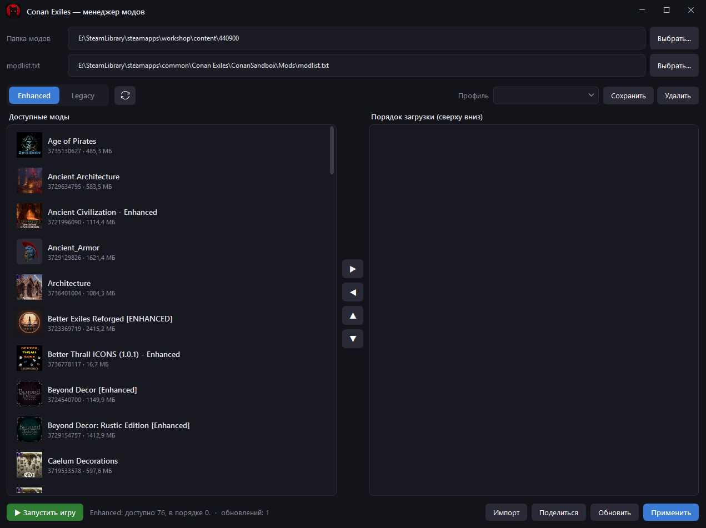

# Conan Mods Sort

Небольшой менеджер модов для **Conan Exiles** (Steam Workshop, appid `440900`). Позволяет наглядно выстроить порядок загрузки модов, разделяет их по версиям игры **Enhanced / Legacy**, умеет проверять и докачивать обновления и делиться списками.

Написан на **C# / WPF (.NET 10)**.



## Возможности

- **Автопоиск** установки Steam, папки модов мастерской и `modlist.txt` (через реестр и `libraryfolders.vdf`); пути можно указать вручную и они сохраняются.
- **Данные из Steam Web API**: названия, размеры, превью модов (с кешем на диске), а также теги для разделения версий.
- **Enhanced / Legacy** — моды раскладываются по вкладкам по тегу; списки не смешиваются.
- **Drag & drop** для порядка загрузки, с превью перетаскиваемого элемента и индикатором места вставки.
- **Профили** — сохранённые наборы/порядок модов, переключение между ними; индикатор несохранённых изменений и запрос при выходе.
- **Проверка обновлений** — сравнивает `time_updated` из Steam с локальной датой установки (`appworkshop_440900.acf`); устаревшие моды помечаются, обновляются одной кнопкой.
- **Загрузка недостающих/устаревших модов** через **SteamCMD** (скачивается автоматически в `%AppData%`), с автоперезапуском при сбоях.
- **Поделиться / импорт** списка модов через буфер обмена (короткий формат — id через запятую).
- **Запуск игры** прямо из приложения.
- Контекстное меню мода: открыть страницу в Steam, открыть папку, копировать id, удалить.

## Требования

- Windows 10/11
- [.NET 10 Desktop Runtime](https://dotnet.microsoft.com/download) (для запуска framework-dependent сборки)
- Установленный через Steam **Conan Exiles**

## Запуск скачанного .exe

> ⚠️ **Файл не подписан цифровой подписью.** При первом запуске Windows SmartScreen
> покажет «Система Windows защитила ваш компьютер». Это нормально для опенсорс-приложений
> без платного сертификата. Чтобы запустить: нажмите **«Подробнее» → «Выполнить в любом случае»**.
>
> При желании можно снять блокировку у файла заранее: ПКМ по `.exe` → **Свойства** →
> внизу отметить **«Разблокировать»** → OK.

## Сборка и запуск

```powershell
dotnet run
```

Один `.exe`, компактно (нужен установленный .NET Desktop Runtime):

```powershell
dotnet publish ConanModsSort.csproj -c Release -r win-x64 --no-self-contained `
  -p:PublishSingleFile=true -p:IncludeNativeLibrariesForSelfExtract=true
```

Один `.exe`, автономно (рантайм не нужен, но крупнее):

```powershell
dotnet publish ConanModsSort.csproj -c Release -r win-x64 --self-contained `
  -p:PublishSingleFile=true -p:IncludeNativeLibrariesForSelfExtract=true `
  -p:EnableCompressionInSingleFile=true
```

Готовые сборки обоих вариантов — на странице [Releases](../../releases).

## Структура проекта

```
/            App.xaml(.cs), Icon.ico/png, .csproj
Views/       MainWindow, InputDialog, MessageDialog (.xaml + .cs)
Models/      ModItem, AppSettings (профили)
Services/    SteamLocator, SteamWorkshopApi, ImageCache, SoftChime
Adorners/    DragAdorner, InsertionAdorner (визуальные подсказки drag&drop)
```

## Заметки

- SteamCMD и моды Conan качаются **анонимно** в реальную папку библиотеки; при первом запуске SteamCMD прогревается вхолостую (он часто виснет на самообновлении).
- Настройки и кеш хранятся в `%AppData%\ConanModsSort`.

## Лицензия

[MIT](LICENSE)
